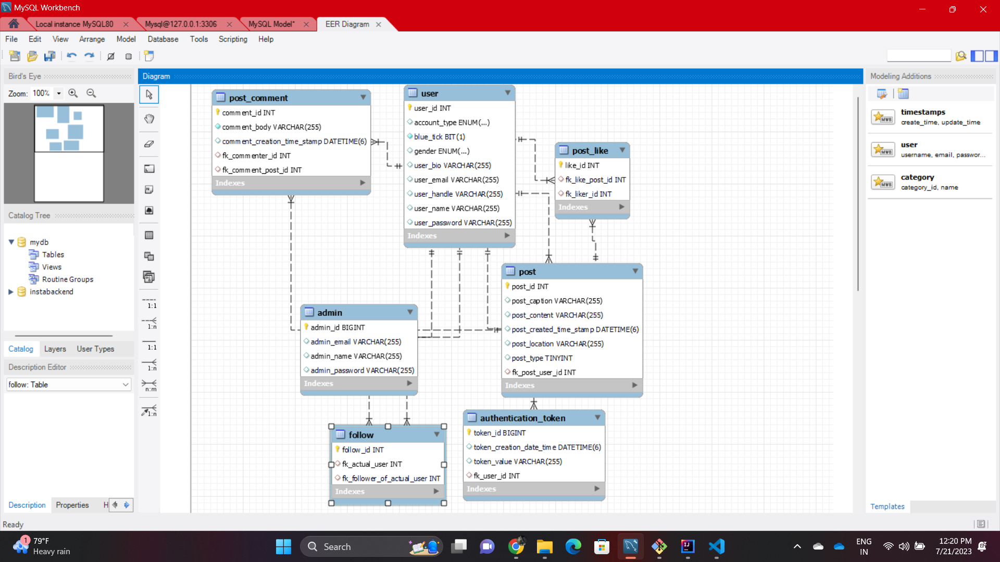

## **Frameworks and language used**
* SpringBoot Framework
* Java
## **Data Flow**
* **Controller** - RestController
  
  Used with @GetMapping, @PostMapping,@DeleteMapping, @RequestBody,@PathVaraiable,@Validated,@RequestParam,@Valid and @Autowired which is linked with business logic in service class.

* **Services**

  * **UserService**

   1. SignUp User
   2. SignIn User
   3. SigOut User
   4. Create Insta Post
   5. Remove Insta Post
   6. Add Comment
   7. Authorize Comment Remover
   8. Remove Insta Comment
   9. Add Like
   10. Get Like Count By Post
   11. Authorize Like Remover
   12. Remove Insta Like
   13. Follow User
   14. Authorize Unfollow
   15. UnFollow User

  * **PostService**

   1. Create Insta Post
   2. Remove Insta Post
   3. Validate Post
   4. Get Post By Id

  * **LikeService**

   1. Add Like
   2. Is Like Allowed On This Post
   3. Get Like Count For Post
   4. Find Like
   5. Remove Like

   * **FollowService**

   1. Start Following
   2. Is Follow Allowed
   3. Find Follow
   4. Unfollow

   * **CommentService**

   1. Add Comment
   2. Find Comment
   3. Remove Comment

   * **AuthenticationService**

   1. Authenticate
   2. Save AuthToken
   3. Find First By User
   4. Remove Token

   

* **Repository**

  JpaRepository

## **DataBase Design**

## **Data Structure used in your project**
* Arraylist
* MYSQL Database
## **Project Summary**

* This is "Instagram Design" Application which follows MVC-architecture.I have created this project by using spring initilizer by taking 7 dependency i.e., lombok, spring web,Mysql,JPA,Email,swagger,and Validation. In my model package I have User,Authentication,Like,Follow,Post,Comment class which has all its related data.
* We can signUp and signIn Instagram App.
* We can comment, Like and Follow User
* We can also Remove comment and unfollow the user.
* Posting of post is also possible by this application.

