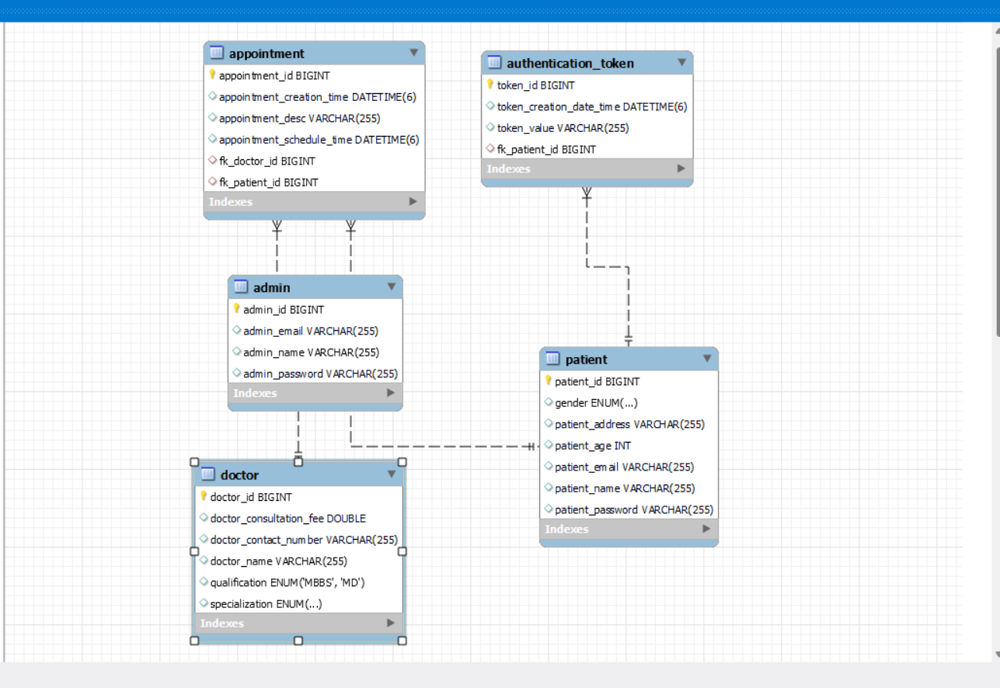

## **Frameworks and language used**
* SpringBoot Framework
* Java
## **Data Flow**
* **Controller** - RestController
  
  Used with @GetMapping, @PostMapping,@DeleteMapping, @RequestBody,@PathVaraiable,@Validated,@Valid and @Autowired which is linked with business logic in service class.

* **Services**

  * **AppointmentService**

   1. Get All Appointments
   2. Save Appointment
   3. Get Appointment For Patient
   4. Cancel Appointment

  * **DoctorService**

   1. Add Doctor
   2. Get All Doctors

  * **PatientService**

   1. SignUp Patient
   2. Get All Patients
   3. SignIn Patient
   4. Schedule Appointment
   5. Cancel Appointment
   6. SigOut Patient

* **Repository**

  JpaRepository

## **DataBase Design**

## **Data Structure used in your project**
* Arraylist
* MYSQL Database
## **Project Summary**

* This is "Doctor-App" Application which follows MVC-architecture.I have created this project by using spring initilizer by taking 7 dependency i.e., lombok, spring web,Mysql,JPA,Email,swagger,and Validation. In my model package I have Doctor,Patient and Appointment class which has all its related data.
* We can signUp and signIn app.
* Book appointment or Cancel Appointment.
* Get all patient Data.
* Add or get All doctors.

